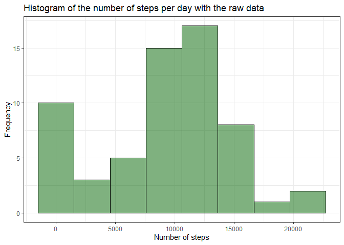
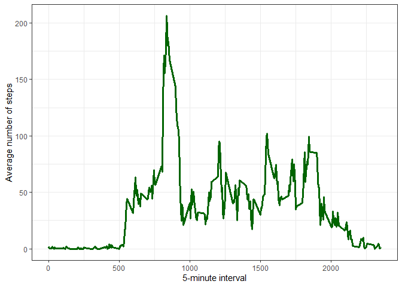
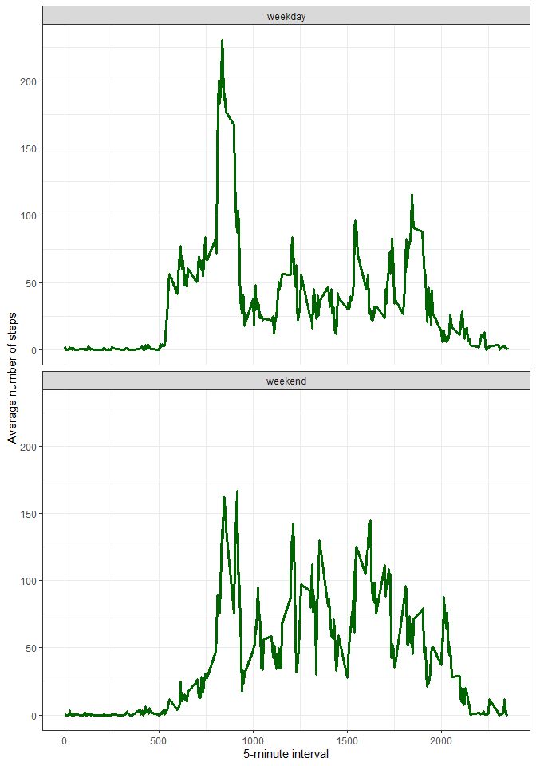

<p>&nbsp;</p> 

This assignment is part of the Coursera-Johns Hopkins University course **Reproducible Research.** You can find more information about it in the `README.md` document.

<p>&nbsp;</p>
## Loading and preprocessing the data
<p>&nbsp;</p>

First we need to prepare the package we will use

```r
library(dplyr)
library(lubridate)
library(ggplot2)
library(cowplot)
```

The GitHub repository contains the dataset, so we do not have to download the data.
We just need to unzip it


```r
if(!file.exists("activity.csv")) {
      unzip("activity.zip")
}

activity <- read.csv("activity.csv")
```


Then we need to change the format of the Date column

```r
activity <- activity %>%
      dplyr::mutate(date = as.Date(date, "%Y-%m-%d"))
```


Explore the data


```r
head(activity, n = 10)
```

```
##    steps       date interval
## 1     NA 2012-10-01        0
## 2     NA 2012-10-01        5
## 3     NA 2012-10-01       10
## 4     NA 2012-10-01       15
## 5     NA 2012-10-01       20
## 6     NA 2012-10-01       25
## 7     NA 2012-10-01       30
## 8     NA 2012-10-01       35
## 9     NA 2012-10-01       40
## 10    NA 2012-10-01       45
```

```r
summary(activity)
```

```
##      steps             date               interval     
##  Min.   :  0.00   Min.   :2012-10-01   Min.   :   0.0  
##  1st Qu.:  0.00   1st Qu.:2012-10-16   1st Qu.: 588.8  
##  Median :  0.00   Median :2012-10-31   Median :1177.5  
##  Mean   : 37.38   Mean   :2012-10-31   Mean   :1177.5  
##  3rd Qu.: 12.00   3rd Qu.:2012-11-15   3rd Qu.:1766.2  
##  Max.   :806.00   Max.   :2012-11-30   Max.   :2355.0  
##  NA's   :2304
```

As we can see, only the column `steps` contains missing values.

<p>&nbsp;</p>
## What is mean total number of steps taken per day?
<p>&nbsp;</p>

To answer this question we will make an histogram using the `ggplot2` system, but first is necessary to sum the steps per day.

So, we will make a new table with the sum of all steps per day

```r
steps_day <- activity %>%
      dplyr::group_by(date) %>%
      dplyr::summarise(steps = sum(steps, na.rm = TRUE))

head(steps_day)
```

```
## # A tibble: 6 x 2
##   date       steps
##   <date>     <int>
## 1 2012-10-01     0
## 2 2012-10-02   126
## 3 2012-10-03 11352
## 4 2012-10-04 12116
## 5 2012-10-05 13294
## 6 2012-10-06 15420
```

Now we will make the histogram


```r
g1 <- ggplot(data = steps_day, mapping = aes(x = steps)) +
   geom_histogram(fill = "darkgreen", alpha = 0.5, color = "black", bins = 8) +
   labs(x = "Number of steps", y = "Frequency", 
        title = "Histogram of the number of steps per day with the raw data") +
   theme_bw()
g1
```

<!-- -->

and calculate the mean and the median of these distribution

```r
# MEAN
mean(steps_day$steps, na.rm = TRUE)
```

```
## [1] 9354.23
```

```r
# MEDIAN
median(steps_day$steps, na.rm = TRUE)
```

```
## [1] 10395
```

<p>&nbsp;</p>
## What is the average daily activity pattern?
<p>&nbsp;</p>

To answer this question we will make a time series plot using the `ggplot2` system, but first is necessary to prepare the data, calculating the mean of steps for each interval of time.

So, we will make a new table with the mean of steps per interval of time

```r
steps_interval <- activity %>%
   dplyr::group_by(interval) %>%
   dplyr::summarise(mean.steps = mean(steps, na.rm = TRUE))
head(steps_interval)
```

```
## # A tibble: 6 x 2
##   interval mean.steps
##      <int>      <dbl>
## 1        0     1.72  
## 2        5     0.340 
## 3       10     0.132 
## 4       15     0.151 
## 5       20     0.0755
## 6       25     2.09
```

Now we will make the time series plot

```r
ggplot(data = steps_interval, mapping = aes(x = interval, y = mean.steps)) +
      geom_line(stat = "identity", colour = "darkgreen", size = 1.2) +
      labs(x = "5-minute interval", y = "Average number of steps") +
      theme_bw()
```

<!-- -->

Which 5-minute interval, on average across all the days in the dataset, contains the maximum number of steps?


```r
max_av_int <- steps_interval %>%
      dplyr::filter(mean.steps == max(mean.steps))
max_av_int
```

```
## # A tibble: 1 x 2
##   interval mean.steps
##      <int>      <dbl>
## 1      835       206.
```

The interval of **835** have the maximum number of steps, with an average of **206** steps.

<p>&nbsp;</p>
## Imputing missing values
<p>&nbsp;</p>

There are a number of days/intervals where there are missing values (`NA`). The presence of missing days may introduce bias into some calculations or summaries of the data.

We will calculate the number of missing values in the dataset, we know that only the column `steps` have missing values

```r
n_nas <- activity %>%
   dplyr::summarise(missing.values = sum(is.na(steps)))
```

There are **2304** NAs in the dataset.

Now, we will create a new dataset that is equal to the original dataset but with the missing data filled. The NAs will be filled with the mean of for that 5-minute interval.


```r
activity2 <- activity

# Do you remember the steps_interval calculation? We will use it again

for(i in 1:length(activity2$steps)) {
   if(is.na(activity2$steps[i])) {
      activity2$steps[i] = round(steps_interval$mean.steps[
         steps_interval$interval == activity2$interval[i]
      ], 2)
   }
}

head(activity2)
```

```
##   steps       date interval
## 1  1.72 2012-10-01        0
## 2  0.34 2012-10-01        5
## 3  0.13 2012-10-01       10
## 4  0.15 2012-10-01       15
## 5  0.08 2012-10-01       20
## 6  2.09 2012-10-01       25
```

We will make a resume table with the sum of all steps per day

```r
steps_day2 <- activity2 %>%
      dplyr::group_by(date) %>%
      dplyr::summarise(steps = sum(steps, na.rm = TRUE))

head(steps_day2)
```

```
## # A tibble: 6 x 2
##   date        steps
##   <date>      <dbl>
## 1 2012-10-01 10766.
## 2 2012-10-02   126 
## 3 2012-10-03 11352 
## 4 2012-10-04 12116 
## 5 2012-10-05 13294 
## 6 2012-10-06 15420
```
Then we will make a new histogram and compare it with the histogram produced with the raw data


```r
g2 <- ggplot(data = steps_day2, mapping = aes(x = steps)) +
   geom_histogram(fill = "orange", alpha = 0.5, color = "black", bins = 8) +
   labs(x = "Number of steps", y = "Frequency",
        title = "Histogram of the number of steps per day with NAs filled") +
   theme_bw()

cowplot::plot_grid(g1,g2)
```


As we can see, the histograms are slightly different, to fill the missing values makes the distribution more symmetric and reduces the frequency of `0`in the data.


we can calculate the mean and the median of the new data

```r
# MEAN
mean(steps_day2$steps, na.rm = TRUE)
```

```
## [1] 10766.18
```

```r
# MEDIAN
median(steps_day2$steps, na.rm = TRUE)
```

```
## [1] 10766.13
```

Remember that these measures for the raw data were `Mean = 9354.23` and `Median = 10395`, so they are quantitatively different. Remove NAs makes the mean and the median more similar to each other.


<p>&nbsp;</p>
## Are there differences in activity patterns between weekdays and weekends?
<p>&nbsp;</p>

We will create a new factor variable in the dataset with two levels – “weekday” and “weekend” indicating whether a given date is a weekday or weekend day

```r
activity2$day <- ifelse(weekdays(activity2$date) %in%  c("sábado", "domingo"),
                        "weekend", "weekday")
head(activity2)
```

```
##   steps       date interval     day
## 1  1.72 2012-10-01        0 weekday
## 2  0.34 2012-10-01        5 weekday
## 3  0.13 2012-10-01       10 weekday
## 4  0.15 2012-10-01       15 weekday
## 5  0.08 2012-10-01       20 weekday
## 6  2.09 2012-10-01       25 weekday
```

Now we will make a panel plot containing a time series plot of the 5-minute interval (x-axis) and the average number of steps taken, averaged across all weekday days or weekend days (y-axis)

First we need to prepare the data

```r
steps_interval2 <- activity2 %>%
   dplyr::group_by(interval, day) %>%
   dplyr::summarise(mean.steps = mean(steps))
head(steps_interval2)
```

```
## # A tibble: 6 x 3
## # Groups:   interval [3]
##   interval day     mean.steps
##      <int> <chr>        <dbl>
## 1        0 weekday     2.25  
## 2        0 weekend     0.215 
## 3        5 weekday     0.445 
## 4        5 weekend     0.0425
## 5       10 weekday     0.173 
## 6       10 weekend     0.0162
```

and make the plot

```r
ggplot(data = steps_interval2, mapping = aes(x = interval, y = mean.steps)) +
   geom_line(stat = "identity", colour = "darkgreen", size = 1.2) +
   facet_wrap(. ~ day, ncol = 1) +
   labs(x = "5-minute interval", y = "Average number of steps") +
   theme_bw()
```

<!-- -->

